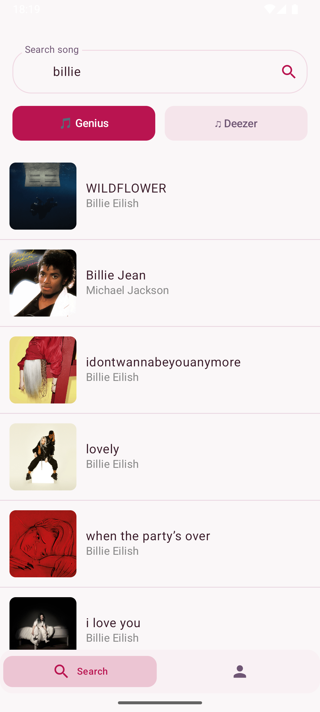
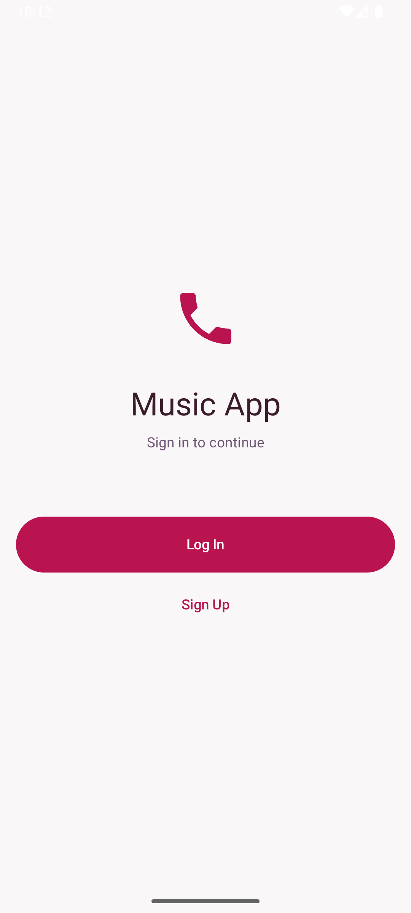
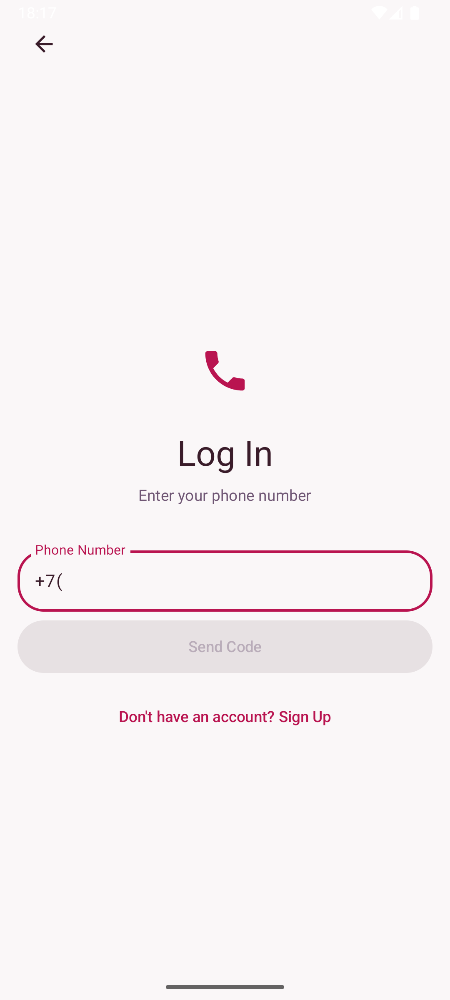
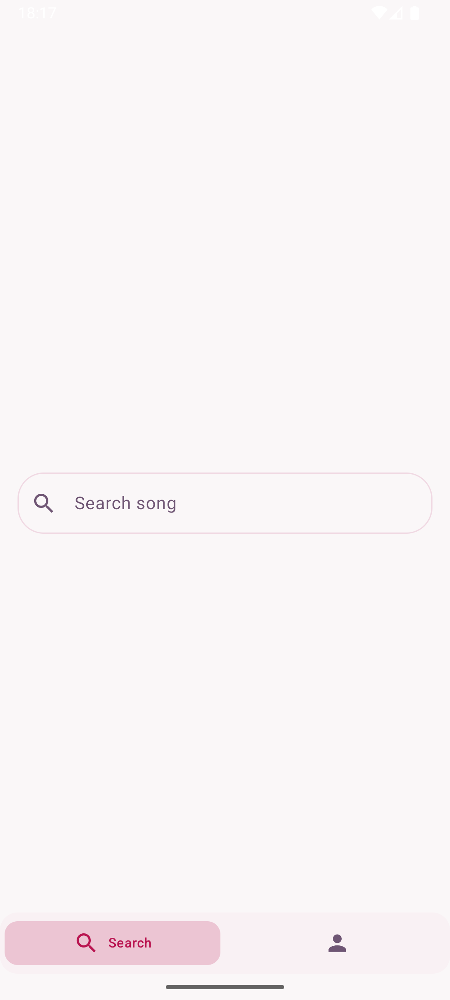
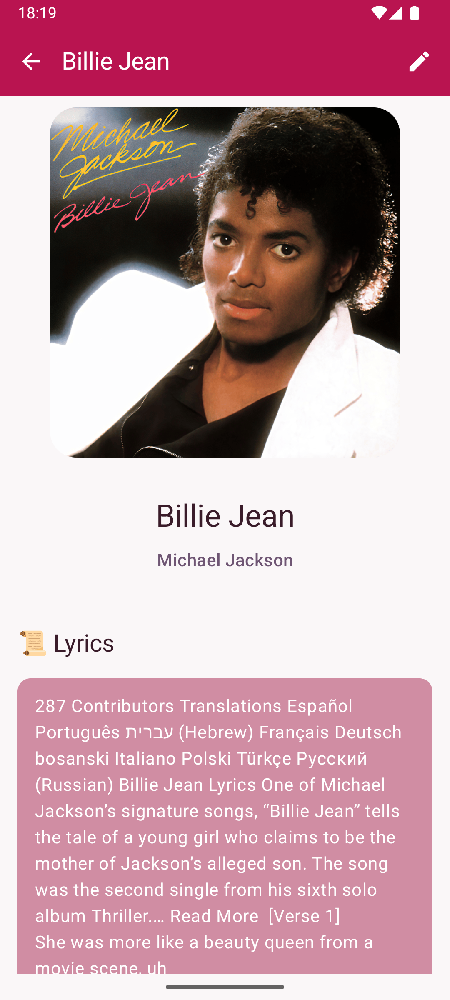
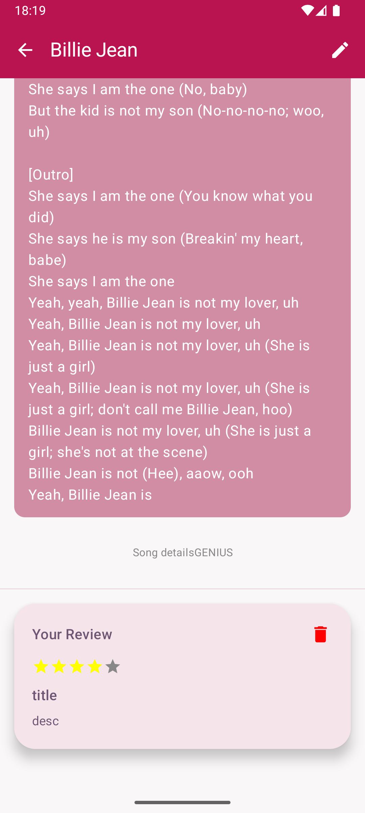
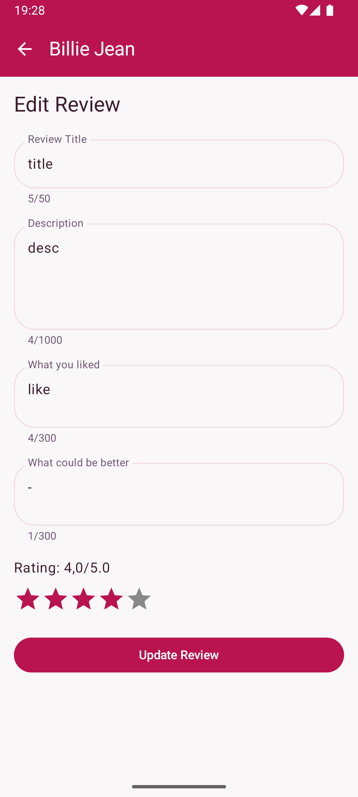
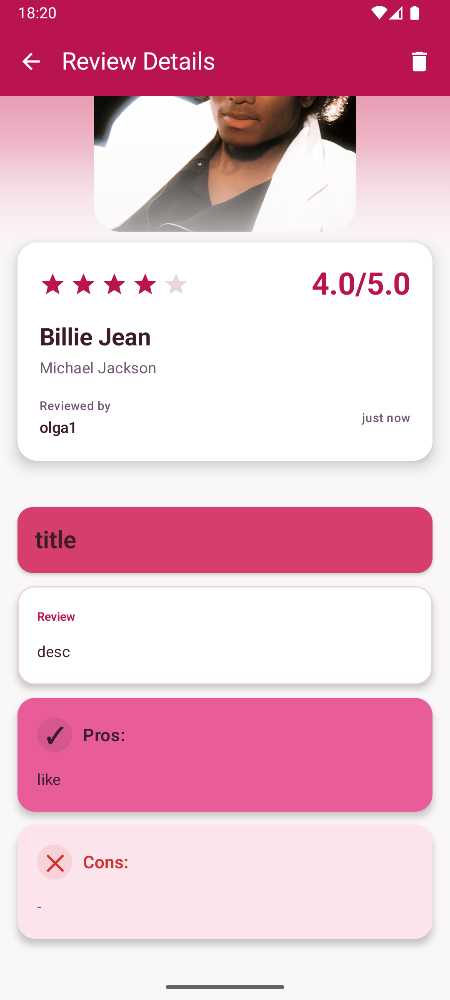
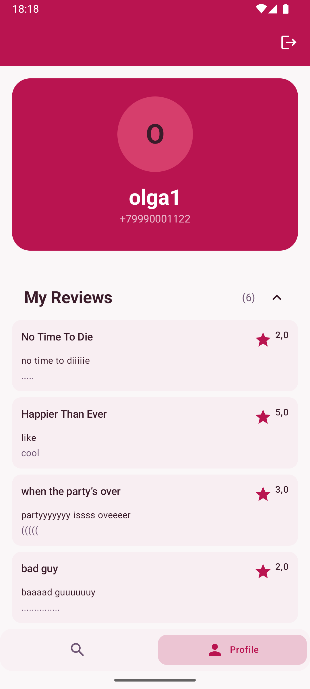

# 🎵 Song Review App

Мобильное Android приложение для поиска песен, создания рецензий и просмотра отзывов других пользователей с интеграцией Firebase и поддержкой музыкального плеера.

---

## 🎬 Видеообзор

> <p align="center">
>   <a href="https://disk.360.yandex.ru/i/60qHQVdYFeqwtA">
>     
>   </a>
>   <br>
>   <em>👆 Нажми для просмотра видео</em>
> </p>
> 
> **Посмотрите видеодемонстрацию приложения** (3 минуты обзора всех функций)

## 🎯 Обзор

**Song Review App** — это приложение для музыкальных фанатов, которые хотят делиться своими мнениями о песнях. Пользователи могут:

- 🔍 Искать песни из различных источников (Genius, Deezer)
- ⭐ Выставлять рейтинги и писать рецензии
- 💬 Читать отзывы других пользователей
- 🔐 Безопасно управлять своим профилем
- 🎶 Слушать превью песен прямо в приложении

---

## ✨ Основные возможности

### 🔐 Аутентификация

- [**Скриншот Auth Screen здесь**](#auth-screen)
- Регистрация и вход через номер телефона
- Многофакторная верификация с использованием SMS кодов
- Ввод имени пользователя при регистрации
- Обработка ошибок и попытки повтора

### 🔍 Поиск песен
- [**Скриншот Search Screen здесь**](#search-screen)
- Поиск по названию или исполнителю
- Фильтрация по источникам (Genius, Deezer)
- Real-time поиск с загрузкой результатов
- Отслеживание аналитики поиска
- Интуитивный UI с индикатором загрузки

### 📍 Детали песни
- [**Скриншот Song Details Screen здесь**](#song-details-screen)
- Полная информация о песне (название, исполнитель, обложка)
- Встроенный плеер для прослушивания превью
- Управление прогрессом воспроизведения
- Ваша рецензия (если есть)
- Рецензии других пользователей
- Возможность добавить/редактировать рецензию

### ✍️ Создание рецензий
- [**Скриншот Review Add Screen здесь**](#review-add-screen)
- Заголовок рецензии
- Подробное описание впечатления
- Список плюсов (pros)
- Список минусов (cons)
- Рейтинг от 1 до 5 звёзд
- Редактирование существующей рецензии

### 📖 Просмотр рецензии
- [**Скриншот Review Details Screen здесь**](#review-details-screen)
- Красивая визуализация с обложкой песни
- Быстрая информация о рейтинге и дате
- Полный текст рецензии с форматированием
- Отдельные секции для плюсов и минусов
- Pull-to-refresh для обновления
- Удаление собственной рецензии
- Отслеживание времени редактирования

### 👤 Профиль пользователя
- [**Скриншот Profile Screen здесь**](#profile-screen)
- Информация о пользователе
- Список всех написанных рецензий
- Развёртываемые секции
- Загрузка дополнительных рецензий
- Выход из аккаунта
- Pull-to-refresh функция

---

## 📸 Скриншоты

<a name="auth-screen"></a>
### 🔐 Аутентификация
> <p align="center">
>   
>   
> </p>

<a name="search-screen"></a>
### 🔍 Поиск песен
> <p align="center">
>   
>   
> </p>

<a name="song-details-screen"></a>
### 🎵 Детали песни
> <p align="center">
>   
>   
>   
> </p>

<a name="review-add-screen"></a>
### ✍️ Рецензии
> <p align="center">
>   
>   
> </p>

<a name="profile-screen"></a>
### 👤 Профиль
> <p align="center">
>   
> </p>


---

## 🛠️ Технический стек

### Язык и фреймворк
- **Язык**: Kotlin 2.2.0
- **UI Framework**: Jetpack Compose 1.10.0
- **API уровень**: Android 8 - 15 (API 27-35)
- **Архитектура**: MVVM + Clean Architecture

### Ключевые зависимости
- **Android Material 3** — современный дизайн и компоненты
- **Jetpack Navigation** — навигация между экранами
- **Firebase** — аутентификация и база данных
- **Coil** — загрузка и кэширование изображений
- **Media3** — встроенный плеер для превью песен
- **Coroutines** — асинхронное программирование
- **Flow** — реактивные потоки данных
- **Dagger 2** — dependency injection

### API интеграции
- **Genius API** — информация о песнях и тексты
- **Deezer API** — поиск и информация о музыке

### UseCase Unit Tests
- Покрывают все тесты
---

## 🚀 Установка

### Предварительные требования
- Android Studio
- Firebase Project с настроенной аутентификацией

### Шаги установки

1. **Клонирование репозитория**
```bash
git clone https://github.com/hkkkkjv/musicapp_android.git
cd musicapp_android
```

2. **Настройка Firebase**
   - Создайте проект в [Firebase Console](https://console.firebase.google.com)
   - Загрузите `google-services.json`
   - Поместите файл в папку `app/`

3. **Настройка API ключа**
   - Получите API ключ для:
     - Genius API (https://genius.com/api-clients)
   - Добавьте в `local.properties`:
   ```properties
   GENIUS_API_KEY=your_genius_key
   ```

4. **Сборка и запуск**
```bash
# Сборка проекта
./gradlew build

# Запуск на эмуляторе/устройстве
./gradlew installDebug
```

---

## 📖 Использование

### Первый запуск

1. **Запустите приложение**
2. **Выберите "Регистрация"** на стартовом экране
3. **Введите имя пользователя**
4. **Введите номер телефона** (+7 XXXXXXXXXX)
5. **Подтвердите SMS код**
6. **Вы в приложении!**

### Основной поток

```
Авторизация → Главная страница (Поиск) → Детали песни → Написать рецензию → Профиль
```

### Примеры действий

**Поиск песни**:
- Перейдите на вкладку "Поиск"
- Введите название песни или исполнителя
- Выберите источник данных (Genius/Deezer)
- Нажмите на результат для просмотра деталей

**Написать рецензию**:
- На странице "Детали песни" нажмите кнопку "Редактировать"
- Заполните форму (название, описание, плюсы/минусы, рейтинг)
- Нажмите "Отправить"

**Просмотр профиля**:
- Нажмите на иконку профиля внизу экрана
- Развёрните раздел "Мои рецензии"
- Нажмите на рецензию для полного просмотра

---


## 🔌 API и интеграции

### Firebase
- **Firebase Authentication** — управление пользователями
- **Firestore Database** — хранение рецензий, профилей
- **Firebase Analytics** — отслеживание событий пользователя

### Внешние API

#### Genius API
```
GET https://api.genius.com/search?q=song_name&access_token=YOUR_TOKEN
```
- Поиск песен
- Получение информации (исполнитель, обложка, ID)
- Тексты песен

#### Deezer API
```
GET https://api.deezer.com/search?q=song_name
```
- Поиск музыки
- Получение ссылок на превью
- Метаданные песен

### Аналитика
- Отслеживание поиска пользователей
- События создания рецензий
- Открытие деталей песни

---

## 📧 Контакты

- **Email**: hkkkkjv@mail.ru
- **GitHub**: [@hkkkkjv](https://github.com/your-username)

---

## 🙏 Благодарности

- Firebase за аутентификацию и базу данных
- Genius и Deezer за API
- Jetpack Compose команде за отличный фреймворк

---

**Последнее обновление**: Январь 2026
